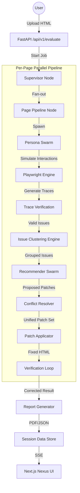

# MAS Usability Tester

A next-generation Multi-Agent System (MAS) for automated usability and accessibility evaluation. It leverages **LangGraph**, **Groq (Llama 3.3)**, and **Playwright** to simulate human interactions, identify friction points, and automatically apply high-quality UI patches.

The system features the **Nexus Design System**, a premium dark-mode dashboard providing real-time telemetry of agent actions, live previews, and detailed diagnostic reports.

---

## 🏗 System Architecture

The MAS Usability Tester is built on a **Massively Parallel Multi-Agent Orchestration** engine. It treats each page as an independent branch in a directed acyclic graph (DAG), executed via LangGraph.

### Core Architecture Flow


---

## 🤖 Agent Breakdown

| Agent | Responsibility | Logic / Model |
| :--- | :--- | :--- |
| **Supervisor** | Orchestrator. Analyzes UI structure and generates targeted Personas. | Llama 3.3 70B |
| **Persona** | Simulated user. Navigates the UI to achieve goals, observing friction/a11y issues. | Llama 3.1 8B |
| **Clusterer** | Grouping engine. Uses HDBSCAN + sentence-embeddings to deduplicate findings. | NLP Models |
| **Recommender** | Specialist. Generates HTML/CSS/JS patches based on issue clusters. | Llama 3.3 70B |
| **Resolver** | Mediator. Resolves overlapping patches and ensures UI consistency. | Llama 3.1 70B |
| **Verifier** | Quality Assurance. Re-runs simulations on patched HTML to confirm fixes. | Llama 3.3 70B |

---

## 📡 Backend Interface (API V1)

The backend provides a rich Server-Sent Events (SSE) telemetry layer.

### Primary Endpoints
- `POST /api/v1/evaluate`: Upload files (max 5) and trigger the pipeline.
- `GET /api/v1/evaluate/{job_id}/stream`: Real-time SSE stream.
- `GET /api/v1/evaluate/{job_id}/issues`: Retrieve clustered issues.
- `GET /api/v1/evaluate/{job_id}/report`: Download PDF summary.
- `GET /api/v1/evaluate/{job_id}/download`: Download ZIP of all patched HTML.
- `GET /api/v1/history`: List past sessions (recovered from disk).
- `GET /api/v1/settings`: System configuration management.

### Real-time Telemetry (SSE Events)
The system emits structured events decoded by the frontend `PipelineContext`:
- `pipeline_start`: Job metadata and file count.
- `persona_start / action`: Live feed of agent thoughts, actions, and **screenshots**.
- `clustering_start / complete`: Status of issue grouping.
- `recommender_start / patch`: Real-time tracking of patch generation.
- `conflict_detected / resolved`: Mediation feedback.
- `patch_applied`: Feedback on file modifications.
- `pipeline_complete`: Final results and download URLs.

---

## 🎨 Frontend: Nexus UI

The frontend is a **Next.js 14** application utilizing the **Nexus Design System**—a high-fidelity, high-interaction UI focused on AI transparency.

- **Dashboard**: Global system health and historical metrics.
- **Component Analyzer**: Drag-and-drop zone for immediate auditing.
- **Live Feed**: Displays active agents, their current action (Click, Type, etc.), and DOM selectors.
- **Trace Visualization**: Visualizing the chain of events leading to a revealed issue.
- **State Machine**: Powered by `PipelineContext.tsx` with full reconnection support (`Last-Event-ID`).

---

## 🛠 Setup & Development

### 1. Requirements
- Python 3.10+
- Node.js 18+ (npm or yarn)
- Groq API Key (for LLM inference)

### 2. Environment Configuration (`.env`)
```bash
# Agent API Keys
SUPERVISOR_API_KEY=gsk_...
PERSONA_API_KEY=gsk_...
RECOMMENDER_API_KEY=gsk_...
RESOLVER_API_KEY=gsk_...

# System Settings
MAX_NUM_PERSONAS=3
PERSONA_MAX_STEPS=10
MAX_CORRECTION_LOOPS=1
LLM_MAX_CONCURRENT_CALLS=5
```

### 3. Execution
**Backend:**
```bash
pip install -r requirements.txt
uvicorn backend.main:app --reload
```

**Frontend:**
```bash
cd frontend
npm install
npm run dev
```

---

## 🦾 AI Reading Guide (Internal Context)

*This section is specifically for other AI agents continuing development on this repo.*

- **Graph Logic**: The core workflow is defined in `core/graph.py`. Do NOT modify the topology without understanding how `PageContext` is expanded/merged between nodes.
- **Prompt Engineering**: System prompts live in `prompts/`. They rely heavily on JSON formatting—ensure any changes maintain schema strictness.
- **Stigmergy Pattern**: Recommenders look at `swarm_claims` to see if peer agents are targeting the same selectors (Found in `agents/recommender/recommender_agent.py`).
- **Telemetry Bridge**: The `backend/pipeline_runner.py` intercepts `stdout` structured logs and pipes them to the SSE stream. If adding new log types, ensure they follow the `_STEP_MAP` or `_FUNC_STEP_MAP` naming conventions.
- **UI State**: The frontend state is a single reducer in ` PipelineContext.tsx`. New SSE event types must be added to the `applyEvent` function to be visible in the UI.

### Known Issues & TODOs
- [ ] **TPM Tracking**: `rate_limiter.py` needs better Tokens-Per-Minute tracking for Groq free-tier stability.
- [ ] **Persistence**: Move `session_store.py` from disk/memory to a persistent DB (PostgreSQL/Redis).
- [ ] **Patch Review UI**: add a side-by-side diff viewer for proposed patches.
