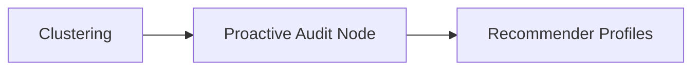
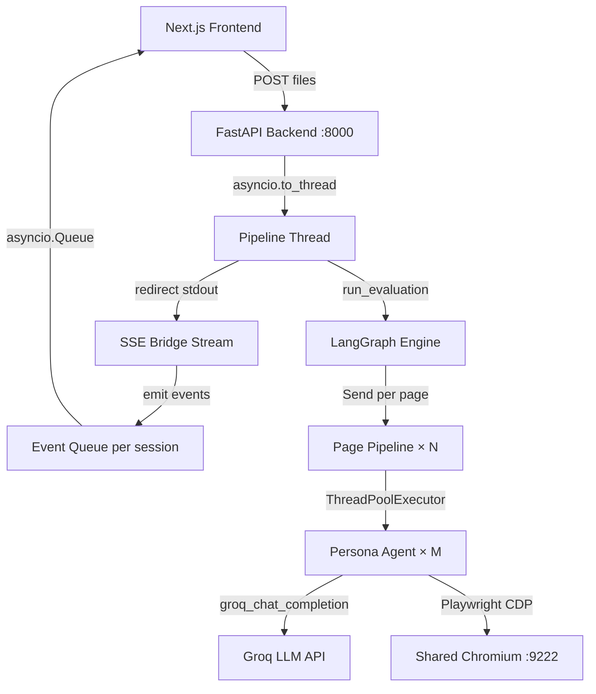

# MAS-Usability-Tester: Comprehensive Optimization Proposal

> Deep analysis of the full codebase completed. This document presents **34 concrete optimization proposals** organized into 3 major areas, each with severity/impact rating, estimated effort, and specific code-level recommendations.

---

## Table of Contents
1. [Persona Simulation Agents](#1-persona-simulation-agents)
2. [Recommender System](#2-recommender-system)
3. [Overall System Architecture](#3-overall-system-architecture)

---

## 1. Persona Simulation Agents

### Current Architecture Analysis

The persona agent operates in a **Perceive → Decide → Act** loop powered by:
- [persona_agent.py](file:///home/agent-adem/Projects/MAS-Usability-Tester/MAS-Usability-Tester/agents/persona/persona_agent.py) — `PersonaRunner` class with `WorkingMemory` state machine
- [playwright_engine.py](file:///home/agent-adem/Projects/MAS-Usability-Tester/MAS-Usability-Tester/agents/persona/playwright_engine.py) — Shared Chromium CDP singleton + isolated `BrowserContext` per persona
- [persona_prompts.py](file:///home/agent-adem/Projects/MAS-Usability-Tester/MAS-Usability-Tester/prompts/persona_prompts.py) — 4-prompt architecture (Understand → Decide → Analyze → Complete)

**Strengths identified:**
- WorkingMemory is Python-enforced (never LLM-mutated) — excellent grounding
- Anti-hallucination: Grounding Guard, Trace-to-State heuristic, loop detection
- Shared browser singleton avoids N process spawns
- Evidence-First protocol with `visible_evidence` array

**Weaknesses identified:**
- Single `_understand_page()` call — never re-evaluates after DOM changes
- No visual regression detection (screenshots captured but never analyzed)
- `observe_count` guard is blunt (3 consecutive → hard stop)
- No cross-persona coordination during simulation
- `_extract_interactive_elements()` caps at 50 elements — loses visibility on complex pages
- No viewport-awareness — can't distinguish above/below-fold elements
- Selector generation is fragile (first class name, no uniqueness guarantees)

---

### P1: Adaptive Page Re-Understanding

> **Impact:** High · **Effort:** Medium

**Problem:** `_understand_page()` runs exactly once at the start. If a persona clicks a nav tab (SPA), the `_ui_map_summary` is stale and the LLM operates on dead context.

**Proposal:** Trigger a **lightweight re-understanding** when DOM mutations exceed a threshold:

```python
# In _simulation_loop(), after execute_action:
dom_hash_before = hash(page_state.visible_text[:500])
result = engine.execute_action(action_type, selector, value)
new_state = engine.get_page_state()
dom_hash_after = hash(new_state.visible_text[:500])

if dom_hash_after != dom_hash_before:
    self._understand_page(new_state)  # Refresh UI map
    self._init_required_fields(new_state)
```

Cost: ~1 extra LLM call per major DOM mutation (click nav, submit form). Budget-bounded to max 2 refreshes per simulation.

---

### P2: Visual Regression Detection via Screenshot Analysis

> **Impact:** High · **Effort:** High

**Problem:** Screenshots are captured after every action (`take_screenshot()`) but only piped to SSE for display. They are never analyzed for visual issues (broken layouts, overlapping elements, cut-off text).

**Proposal:** Add a **lightweight visual analysis step** using the LLM's multimodal capability or a heuristic image analyzer:

1. **Option A (fast):** After each action, compare consecutive screenshot byte hashes. If no visual change after a click → flag as potential broken interaction.
2. **Option B (thorough):** Every N steps, send the current screenshot to a vision-capable LLM endpoint with a prompt: *"Does this UI show any visual defects: overlapping text, cut-off elements, invisible buttons, broken layout?"*

This fills the biggest gap: **the current system can only detect issues the LLM can reason about from DOM text — it cannot see the rendered page.**

---

### P3: Smarter Observe-to-Action Escalation

> **Impact:** Medium · **Effort:** Low

**Problem:** The observe spiral guard (`observe_count >= 3 → dead_end`) is too blunt. After submitting a form, 2-3 observes may be legitimate (waiting for async validation). The current guard conflates "the agent is stuck" with "the page is loading."

**Proposal:**
```python
# Replace the hard cutoff with phase-aware logic:
if self._mem.observe_count >= 3:
    if self._mem.page_phase in (PagePhase.SUBMITTED, PagePhase.AWAITING_REDIRECT):
        # Legitimate wait — check for success indicators
        if _has_success_indicator(page_state):
            self._mem.page_phase = PagePhase.SUCCESS
            return StopReason.GOAL_ACHIEVED
        elif self._mem.observe_count >= 5:
            return StopReason.DEAD_END  # Extended patience exhausted
        else:
            continue  # Allow 2 more observes
    elif self._mem.page_phase == PagePhase.FILLING_FORM:
        if self._mem.fields_required:
            # Force the agent to fill next required field
            forced_decision = self._force_fill_next(page_state)
            # ... execute forced action
        else:
            return StopReason.DEAD_END
```

---

### P4: Viewport-Aware Element Extraction

> **Impact:** Medium · **Effort:** Medium

**Problem:** `_extract_interactive_elements()` returns all visible elements up to 50, but the LLM doesn't know which are in the viewport vs. below the fold. This leads to the LLM trying to interact with off-screen elements.

**Proposal:** Enrich `VisibleElement` with a `in_viewport: bool` flag:
```javascript
// In _extract_interactive_elements() JS:
const inViewport = rect.y >= 0 && rect.y < window.innerHeight
                && rect.x >= 0 && rect.x < window.innerWidth;
```

Then in `DOMState.to_prompt_string()`, partition elements:
```
ELEMENTS IN VIEWPORT (12):
  ...
ELEMENTS BELOW FOLD (8) — scroll down to reach:
  ...
```

This dramatically improves the LLM's spatial reasoning.

---

### P5: Robust Unique Selector Generation

> **Impact:** High · **Effort:** Medium

**Problem:** The current selector generation in `_extract_interactive_elements()` uses a brittle priority: `#id > [name] > .first-class > tag`. This fails on:
- Multiple elements sharing the same class (`.btn` appears 5 times)
- Elements with no id, name, or class (bare `<a>` tags)
- Dynamic components with auto-generated ids

**Proposal:** Replace with a **nth-child fallback chain**:
```javascript
function uniqueSelector(el) {
    if (el.id) return '#' + CSS.escape(el.id);
    
    // Try data-testid first (if present)
    const testId = el.getAttribute('data-testid');
    if (testId) return `[data-testid="${testId}"]`;
    
    // Try name attr
    if (el.name) return `${el.tagName.toLowerCase()}[name="${el.name}"]`;
    
    // Build a chain: tag.class:nth-of-type(n)
    const parent = el.parentElement;
    if (!parent) return el.tagName.toLowerCase();
    
    const siblings = Array.from(parent.children);
    const sameTagSiblings = siblings.filter(s => s.tagName === el.tagName);
    if (sameTagSiblings.length === 1) {
        return el.tagName.toLowerCase() + 
               (el.className ? '.' + el.className.trim().split(/\s+/)[0] : '');
    }
    const idx = sameTagSiblings.indexOf(el) + 1;
    return `${el.tagName.toLowerCase()}:nth-of-type(${idx})`;
}
```

---

### P6: Multi-Strategy Persona Behaviors

> **Impact:** High · **Effort:** Medium

**Problem:** All personas follow the same linear strategy: understand → fill fields → submit. Real users exhibit diverse patterns: some explore before acting, some skip instructions, some use keyboard-only navigation.

**Proposal:** Add a `behavior_strategy` field to `PersonaProfile` and inject it into the decision prompt:

| Strategy | Behavior |
|:---|:---|
| `linear_completer` | Fill fields in order, submit immediately |
| `explorer` | Click around the page first, then fill fields |
| `keyboard_navigator` | Tab through elements, never use mouse |
| `error_first` | Submit empty form first to test validation |
| `speed_rusher` | Skip optional fields, minimal reading |

Implementation: Add strategy-specific instructions to `DECISION_SYSTEM` as a conditional block based on `{behavior_strategy}`.

---

### P7: Cross-Persona Coordination (Inter-Agent Memory)

> **Impact:** Medium · **Effort:** High

**Problem:** Personas run in parallel with no shared context. Two personas may discover the same bug independently (wasting LLM calls), or conversely, all personas may follow the same navigation path.

**Proposal:** Introduce a lightweight **shared discovery board** (thread-safe dict):
```python
class SharedDiscoveryBoard:
    """Inter-persona coordination — read-only after your persona writes."""
    def __init__(self):
        self._lock = threading.Lock()
        self._discoveries: list[dict] = []  # {persona_id, selector, issue_type}
    
    def report(self, persona_id: str, selector: str, issue_type: str):
        with self._lock:
            self._discoveries.append({...})
    
    def already_reported(self, selector: str) -> bool:
        with self._lock:
            return any(d["selector"] == selector for d in self._discoveries)
```

Inject into the decision prompt: *"Other personas have already reported issues on: #email (missing label), .nav-btn (no focus ring). Focus on un-explored areas."*

---

### P8: Screenshot Deduplication for SSE Bandwidth

> **Impact:** Medium · **Effort:** Low

**Problem:** `take_screenshot()` is called after every action AND inside `execute_action()` (via `_take_screenshot()`). Two screenshots per step. Base64-encoded JPEG at 1280×720 = ~50-100KB per screenshot. A 10-step persona generates 1-2MB of screenshot data piped through SSE.

**Proposal:**
1. Remove the duplicate screenshot call in `execute_action()` — only keep the one in `_simulation_loop()`
2. Hash consecutive screenshots and skip emission if identical (no visual change)
3. Downsample to 640×360 for SSE transmission (the frontend can request full-res on demand)

---

### P9: Structured Action Traces with Correlation IDs

> **Impact:** Medium · **Effort:** Low

**Problem:** When debugging a failed persona run, tracing the exact sequence of events requires correlating structlog messages by `persona_id` + `step` across stdout. There's no single trace ID.

**Proposal:** Generate a `trace_id` (UUID) at the start of each persona run. Attach it to every log line, every LLM call label, and every SSE event. This enables:
- Frontend trace visualization (click a trace_id → see all events)
- Post-mortem debugging (grep by trace_id)
- Duration analysis per trace

---

## 2. Recommender System

### Current Architecture Analysis

The recommender operates in a **Profile → Propose → Resolve → Apply → Verify** pipeline:
- [supervisor_agent.py](file:///home/agent-adem/Projects/MAS-Usability-Tester/MAS-Usability-Tester/agents/supervisor/supervisor_agent.py) `recommender_profile_node()` — generates `RecommenderProfile` per cluster
- [recommender_agent.py](file:///home/agent-adem/Projects/MAS-Usability-Tester/MAS-Usability-Tester/agents/recommender/recommender_agent.py) — LLM-driven patch generation with stigmergy (swarm_claims)
- [conflict_resolver.py](file:///home/agent-adem/Projects/MAS-Usability-Tester/MAS-Usability-Tester/agents/recommender/conflict_resolver.py) — LLM negotiation + heuristic fallback
- [patch_applicator.py](file:///home/agent-adem/Projects/MAS-Usability-Tester/MAS-Usability-Tester/agents/supervisor/patch_applicator.py) — HTML/CSS/JS injection

**Strengths identified:**
- "Bold Directive" prompt forces architectural fixes over cosmetic aria-labels
- Stigmergy pattern (swarm_claims) prevents duplicate selectors
- Multi-type patching: HTML replacement + CSS injection + JS injection
- Robust fallback chain: exact match → whitespace-norm → attribute-targeted
- PatchType normalization handles LLM alias variability

**Weaknesses identified:**
- `_extract_relevant_html()` uses naive string search (first affected element in source)
- No AST-based HTML validation — injected patches may produce invalid HTML
- `css_snippet` dedup uses string normalization, not parsed CSS comparison
- Recommender has no access to computed styles (only source `<style>` blocks)
- No design system awareness — patches may break existing visual consistency
- Confidence scores are self-reported by the LLM (unreliable)
- Fallback proposals have `confidence: 0.0` and apply zero changes
- JS patches are never tested for syntax validity

---

### R1: AST-Based HTML Validation Pre/Post Patch

> **Impact:** Critical · **Effort:** Medium

**Problem:** `patch_applicator.py` does string replacement on raw HTML. If the LLM's `before_snippet` has a slight whitespace difference, the replacement silently fails (skipped). If it succeeds with a malformed `after_snippet`, the entire HTML may become invalid.

**Proposal:** Use `html.parser` or `lxml` to validate patches:

```python
from html.parser import HTMLParser

class _ValidateHTML(HTMLParser):
    def __init__(self):
        super().__init__()
        self.errors = []
    def handle_starttag(self, tag, attrs): pass
    def handle_endtag(self, tag): pass
    # Override error() to collect instead of raise

def _validate_patch_result(html: str, patch_id: str) -> list[str]:
    """Quick structural validation after applying a patch."""
    validator = _ValidateHTML()
    try:
        validator.feed(html)
    except Exception as e:
        return [f"Patch {patch_id} produced malformed HTML: {e}"]
    return validator.errors
```

Run after each `_apply_single_patch()`. If validation fails, **roll back the patch** and log it as skipped.

---

### R2: Computed Style Injection for Design-Aware Fixes

> **Impact:** High · **Effort:** Medium

**Problem:** `_extract_global_styles()` only captures `<style>` blocks from the source HTML. The recommender has no visibility into:
- Linked stylesheets (`<link rel="stylesheet">`)
- Computed styles (the actual rendered values)
- CSS custom properties (`--color-primary`, etc.)

This means the recommender can't propose fixes that are consistent with the existing design system.

**Proposal:** Before the recommender phase, run a Playwright-based **computed style extractor**:

```python
def extract_computed_design_tokens(page) -> dict:
    """Extract key computed CSS values from the rendered page."""
    return page.evaluate("""() => {
        const body = window.getComputedStyle(document.body);
        const h1 = document.querySelector('h1');
        const btn = document.querySelector('button, [role="button"], .btn');
        return {
            body_bg: body.backgroundColor,
            body_color: body.color,
            body_font: body.fontFamily,
            body_font_size: body.fontSize,
            heading_color: h1 ? getComputedStyle(h1).color : null,
            heading_font: h1 ? getComputedStyle(h1).fontFamily : null,
            btn_bg: btn ? getComputedStyle(btn).backgroundColor : null,
            btn_color: btn ? getComputedStyle(btn).color : null,
            btn_border_radius: btn ? getComputedStyle(btn).borderRadius : null,
            link_color: getComputedStyle(document.querySelector('a') || document.body).color,
            // CSS custom properties
            custom_properties: (() => {
                const vars = {};
                for (const sheet of document.styleSheets) {
                    try {
                        for (const rule of sheet.cssRules) {
                            if (rule.selectorText === ':root') {
                                for (const prop of rule.style) {
                                    if (prop.startsWith('--'))
                                        vars[prop] = rule.style.getPropertyValue(prop).trim();
                                }
                            }
                        }
                    } catch(e) {}
                }
                return vars;
            })()
        };
    }""")
```

Inject the result into `RECOMMENDER_USER` as `{computed_design_tokens}`. This enables the recommender to propose fixes that use existing CSS custom properties and match the page's visual language.

---

### R3: Proactive Issue Detection (Beyond Persona Reports)

> **Impact:** High · **Effort:** High

**Problem:** The recommender only fixes issues found by personas. If a persona doesn't encounter a problem (e.g., it navigated away before encountering a low-contrast section), the issue goes unfixed.

**Proposal:** Add a **Proactive Audit Node** between clustering and recommending:



The Proactive Audit Node uses Playwright to run automated checks:
1. **axe-core** accessibility audit (inject `axe.min.js` into the page)
2. **Contrast checker**: iterate visible text elements, compute contrast ratio via `getComputedStyle()`
3. **Focus ring checker**: tab through all interactive elements, screenshot each focus state
4. **Landmark checker**: verify ARIA landmarks exist

Detected issues are merged with persona-reported issues before clustering.

---

### R4: Confidence Score Validation (Ground-Truth Anchoring)

> **Impact:** Medium · **Effort:** Low

**Problem:** Confidence scores are self-reported by the LLM and uniformly unreliable. The LLM often reports 0.85 even when the `before_snippet` doesn't match anything in the HTML.

**Proposal:** Override LLM confidence with a **computed confidence** post-parse:

```python
def _compute_real_confidence(proposal: PatchProposal, html: str) -> float:
    base = 0.3  # Every valid proposal starts at 0.3
    
    # +0.3 if before_snippet found in HTML (exact)
    if proposal.before_snippet and proposal.before_snippet.strip() in html:
        base += 0.3
    # +0.2 if before_snippet found (whitespace-normalized)
    elif proposal.before_snippet and _normalise_ws(proposal.before_snippet.strip()) in _normalise_ws(html):
        base += 0.2
    
    # +0.2 if target_element selector found in HTML
    sel_base = proposal.target_element.lstrip("#.").split("[")[0]
    if sel_base in html:
        base += 0.2
    
    # +0.1 if has WCAG reference
    if proposal.wcag_reference:
        base += 0.1
    
    # CSS/JS patches: +0.15 if snippet is syntactically valid
    if proposal.css_snippet and '{' in proposal.css_snippet and '}' in proposal.css_snippet:
        base += 0.15
    
    return min(base, 0.95)
```

---

### R5: Multi-Pass Recommender with Self-Critique

> **Impact:** High · **Effort:** Medium

**Problem:** Each recommender makes a single LLM call and submits its proposal. There is no self-review step. The LLM frequently produces patches where:
- `before_snippet` doesn't match the actual HTML
- `css_snippet` uses selectors that don't exist
- `after_snippet` is identical to `before_snippet` (no-op)

**Proposal:** Add a **self-critique pass** before returning the proposal:

```python
def _propose_patch_with_critique(profile, cluster, html_content, ...):
    # Pass 1: Generate proposal
    proposal = _propose_patch(profile, cluster, html_content, ...)
    if proposal is None:
        return None
    
    # Pass 2: Self-critique
    critique_prompt = f"""
    Review this patch proposal for {profile.cluster_id}:
    {json.dumps(proposal.model_dump(), indent=2)}
    
    Against the actual HTML:
    {_extract_relevant_html(html_content, profile.affected_elements)}
    
    Check:
    1. Does before_snippet EXACTLY match something in the HTML?
    2. Is after_snippet meaningfully different from before_snippet?
    3. For CSS patches: does css_snippet target real selectors?
    4. Is the patch_type correct for the fix being proposed?
    
    Output corrections or "APPROVED" if the patch is correct.
    """
    # Apply corrections and return refined proposal
```

This doubles the LLM cost per recommender but dramatically improves patch accuracy.

---

### R6: Design System Awareness Module

> **Impact:** High · **Effort:** High

**Problem:** The recommender generates CSS that may use colors, fonts, and spacing inconsistent with the page's existing design system. For example, it might add `outline: 3px solid blue` on a page that uses `--accent-color: #4CAF50`.

**Proposal:** Create a `DesignTokenExtractor` that runs before the recommender phase:

```python
@dataclass
class DesignSystem:
    primary_color: str
    secondary_color: str
    font_family: str
    heading_font: str
    border_radius: str
    spacing_unit: str  # e.g., "8px" or "0.5rem"
    focus_color: str
    error_color: str
    success_color: str
    custom_properties: dict[str, str]
```

Inject as a structured block into the recommender prompt:
```
DESIGN SYSTEM (use these values in your CSS patches):
  --primary-color: #4CAF50
  --focus-ring: 3px solid var(--primary-color)
  --font-family: 'Inter', sans-serif
  --border-radius: 8px
  ...
```

---

### R7: JS Syntax Validation Before Application

> **Impact:** Medium · **Effort:** Low

**Problem:** `js_snippet` patches are injected directly into `<script>` tags without validation. Syntax errors in the generated JS will break all subsequent scripts on the page.

**Proposal:** Use `subprocess + node --check` or a Python JS parser:
```python
import subprocess, tempfile

def _validate_js(snippet: str) -> tuple[bool, str]:
    with tempfile.NamedTemporaryFile(suffix='.js', mode='w', delete=False) as f:
        f.write(snippet)
        f.flush()
        result = subprocess.run(
            ['node', '--check', f.name],
            capture_output=True, text=True, timeout=5
        )
        return result.returncode == 0, result.stderr
```

Skip JS patches that fail syntax validation and log the error.

---

### R8: Prioritized Patch Ordering by Impact Score

> **Impact:** Medium · **Effort:** Low

**Problem:** Patches are applied in a fixed order: HTML → CSS → JS → remove. This doesn't consider issue severity or patch confidence. A low-confidence CSS patch runs before a high-confidence HTML fix.

**Proposal:** Sort by `(severity_weight * confidence)` descending:
```python
_SEV_WEIGHT = {"critical": 4, "high": 3, "medium": 2, "low": 1}

patches_sorted = sorted(
    patches,
    key=lambda p: (
        _SEV_WEIGHT.get(p.severity_addressed, 1) * p.confidence,
    ),
    reverse=True,
)
```

Apply highest-impact patches first so early failures don't prevent later critical fixes.

---

## 3. Overall System Architecture

### Current Architecture Analysis



**Strengths:**
- Clean SSE reconnection with `Last-Event-ID`
- Session recovery from disk (`SessionStore.get()`)
- Heartbeat thread prevents SSE timeouts
- Rate limiter with semaphore + shared backoff + TPM tracking
- API key rotation on rate limits

**Weaknesses:**
- `_SSEBridgeStream` parses structlog by string matching — extremely fragile
- Event buffer grows unbounded in memory (`self._events[session_id]`)
- Session store has no TTL — old sessions accumulate on disk
- Pipeline runner `_run_real_pipeline()` is 300+ lines of monolithic extraction logic
- No health check for the Chromium CDP process
- Settings mutation via POST `/api/v1/settings` modifies a Pydantic singleton
- `total_score` calculation is broken (L117: `.get()` on PageContext objects, not dicts)
- No graceful shutdown — if the server restarts, running pipelines are orphaned
- Frontend receives base64 screenshots via SSE — massive bandwidth waste

---

### A1: Replace Stdout Hijacking with Direct Event Emission

> **Impact:** Critical · **Effort:** High

**Problem:** The `_SSEBridgeStream` intercepts `sys.stdout` and parses structlog console output via regex string matching (L256-295 of `pipeline_runner.py`). This is:
- **Fragile**: any structlog format change breaks it
- **Lossy**: regex extraction of fields fails on special characters
- **Slow**: every `print()` in the process triggers regex parsing
- **Non-composable**: only one stdout interceptor can exist

**Proposal:** Replace with a **direct event emitter** pattern. Create an `EventBus` that pipeline nodes call explicitly:

```python
# core/event_bus.py
import threading
from typing import Callable, Optional

class EventBus:
    """Thread-safe event emission for pipeline → SSE bridge."""
    _instance: Optional["EventBus"] = None
    _lock = threading.Lock()
    
    def __init__(self):
        self._handlers: list[Callable] = []
    
    @classmethod
    def get(cls) -> "EventBus":
        with cls._lock:
            if cls._instance is None:
                cls._instance = cls()
            return cls._instance
    
    def subscribe(self, handler: Callable[[str, dict], None]):
        self._handlers.append(handler)
    
    def emit(self, event_type: str, **payload):
        for handler in self._handlers:
            try:
                handler(event_type, payload)
            except Exception:
                pass
```

Then in each node:
```python
from core.event_bus import EventBus

def persona_node(state: dict) -> dict:
    bus = EventBus.get()
    bus.emit("persona_start", persona_id=persona.persona_id, name=persona.name)
    # ...
    bus.emit("persona_action", step=step_num, action_type=action_type, ...)
```

And in `pipeline_runner.py`:
```python
bus = EventBus.get()
bus.subscribe(lambda event_type, payload: 
    emit(EventKind(event_type), **payload)
)
state = run_evaluation(pages=pages)
```

**This eliminates the stdout hijacking entirely** and provides structured, typed events from source.

---

### A2: Bounded Event Buffer with Ring Buffer

> **Impact:** Medium · **Effort:** Low

**Problem:** `SessionStore._events[session_id]` is an unbounded list. A long-running pipeline with verbose logging can accumulate thousands of events. Old sessions never have their event buffers cleaned.

**Proposal:**
```python
from collections import deque

class SessionStore:
    MAX_EVENTS_PER_SESSION = 500
    
    async def create(self, session_id, files):
        # ...
        self._events[session_id] = deque(maxlen=self.MAX_EVENTS_PER_SESSION)
```

For reconnection: `Last-Event-ID` still works because events have monotonic IDs. If a reconnecting client asks for an ID older than the buffer, replay all buffered events.

---

### A3: Session TTL and Garbage Collection

> **Impact:** Medium · **Effort:** Low

**Problem:** Sessions accumulate on disk indefinitely (`backend/sessions/`). Every HTML file uploaded is saved permanently.

**Proposal:**
```python
import time

class SessionStore:
    SESSION_TTL_HOURS = 24
    
    def _gc_expired(self):
        """Called periodically (e.g., on each create()) to remove old sessions."""
        cutoff = datetime.utcnow() - timedelta(hours=self.SESSION_TTL_HOURS)
        for d in SESSIONS_DIR.iterdir():
            if d.is_dir():
                mtime = datetime.fromtimestamp(d.stat().st_mtime)
                if mtime < cutoff:
                    shutil.rmtree(d)
                    self._sessions.pop(d.name, None)
                    self._events.pop(d.name, None)
```

---

### A4: Fix Broken Score Aggregation

> **Impact:** High · **Effort:** Low (bugfix)

**Problem:** In `pipeline_runner.py` L117:
```python
total_score = sum(r.get("overall_score", 0) for r in all_results if "overall_score" in r)
```
But `all_results` at this point contains PageContext objects (dataclasses), not dicts. `.get()` fails silently because PageContext doesn't have `.get()`. Score aggregation is always 0.

**Fix:**
```python
total_score = sum(
    r.get("overall_score", 0) if isinstance(r, dict) else 0
    for r in all_results
)
```
Or better — compute from the report objects:
```python
total_score = sum(
    r["overall_score"] for r in all_results 
    if isinstance(r, dict) and "overall_score" in r
)
```

---

### A5: Screenshot Streaming via Separate Endpoint

> **Impact:** High · **Effort:** Medium

**Problem:** Base64-encoded screenshots are embedded inside SSE `data:` payloads. A single persona action event with screenshot is ~100KB of JSON. This:
- Bloats the SSE stream
- Causes the EventSource buffer to lag
- Wastes bandwidth if the user isn't watching the live feed

**Proposal:** Decouple screenshots from SSE:

1. Save screenshots to disk: `sessions/{id}/output/screenshots/persona_1_step_3.jpg`
2. SSE event includes only a URL: `"screenshot_url": "/api/v1/evaluate/{id}/screenshots/persona_1_step_3.jpg"`
3. New endpoint: `GET /api/v1/evaluate/{id}/screenshots/{filename}`
4. Frontend lazily loads screenshots only when the live feed panel is visible

---

### A6: WebSocket Upgrade for Bidirectional Communication

> **Impact:** Medium · **Effort:** High

**Problem:** SSE is one-directional (server → client). The frontend cannot:
- Cancel a running pipeline
- Adjust parameters mid-run (e.g., skip remaining personas)
- Request a re-evaluation of a specific page

**Proposal:** Add a WebSocket endpoint alongside SSE:
```python
@app.websocket("/api/v1/evaluate/{job_id}/ws")
async def ws_evaluate(websocket: WebSocket, job_id: str):
    await websocket.accept()
    session = _get_session(job_id)
    
    # Send events
    async for event in store.subscribe(job_id):
        await websocket.send_json(event)
        
        # Listen for commands
        try:
            cmd = await asyncio.wait_for(websocket.receive_json(), timeout=0.1)
            if cmd.get("action") == "cancel":
                session.status = SessionStatus.FAILED
                break
        except asyncio.TimeoutError:
            pass
```

> [!NOTE]
> Keep SSE as the default (simpler, auto-reconnect). Offer WebSocket for advanced features.

---

### A7: Structured Logging with OpenTelemetry Traces

> **Impact:** High · **Effort:** Medium

**Problem:** The current logging uses `structlog` with console rendering. In production, diagnosing issues requires correlating logs across agents, LLM calls, and Playwright actions — all identified only by `persona_id` strings.

**Proposal:** Add OpenTelemetry tracing:

```python
from opentelemetry import trace

tracer = trace.get_tracer("mas-usability")

def persona_node(state):
    with tracer.start_as_current_span("persona_simulation",
        attributes={"persona.id": persona.persona_id, "persona.name": persona.name}):
        runner = PersonaRunner(persona, state)
        result = runner.run()
```

Spans propagate automatically through LLM calls, Playwright actions, and pipeline nodes. Export to Jaeger/Zipkin for visualization.

---

### A8: Graceful Pipeline Cancellation

> **Impact:** Medium · **Effort:** Medium

**Problem:** There is no cancellation mechanism. If a user closes the browser or wants to stop a stuck pipeline, it runs until completion or crash.

**Proposal:** Add a `CancellationToken` pattern:

```python
class CancellationToken:
    def __init__(self):
        self._cancelled = threading.Event()
    
    def cancel(self):
        self._cancelled.set()
    
    @property
    def is_cancelled(self) -> bool:
        return self._cancelled.is_set()

# Thread through the pipeline and check periodically
def _simulation_loop(self, sandbox_path, cancel_token):
    for step_num in range(...):
        if cancel_token.is_cancelled:
            return StopReason.CANCELLED
        # ...
```

Backend endpoint:
```python
@app.post("/api/v1/evaluate/{job_id}/cancel")
async def cancel_job(job_id: str):
    session = _get_session(job_id)
    session.cancel_token.cancel()
    return {"status": "cancelling"}
```

---

### A9: Database-Backed Session Store

> **Impact:** High · **Effort:** High

**Problem:** `SessionStore` is in-memory + filesystem. On server restart, running sessions are lost. Event buffers are lost. There's no query capability (e.g., "list all sessions from last week").

**Proposal:** Migrate to SQLite (lightweight) or PostgreSQL:

```python
# schema
CREATE TABLE sessions (
    id TEXT PRIMARY KEY,
    status TEXT NOT NULL DEFAULT 'ready',
    input_files JSONB,
    results JSONB,
    created_at TIMESTAMP DEFAULT NOW(),
    started_at TIMESTAMP,
    finished_at TIMESTAMP
);

CREATE TABLE events (
    id SERIAL PRIMARY KEY,
    session_id TEXT REFERENCES sessions(id),
    event_id INTEGER,
    kind TEXT,
    payload JSONB,
    created_at TIMESTAMP DEFAULT NOW()
);
```

Use Redis Pub/Sub for real-time event streaming (replaces `asyncio.Queue`).

---

### A10: Rate Limiter TPM Accuracy

> **Impact:** Medium · **Effort:** Low

**Problem:** The TPM tracker (in `rate_limiter.py`) uses a rough estimate: `estimated_tokens = sum(content_length // 4) + max_tokens`. This:
- Over-estimates for short prompts
- Under-estimates for long system prompts with many template variables
- Never reconciles with actual token usage from the API response

**Proposal:** After each successful API call, update the TPM tracker with actual tokens:
```python
response = client.chat.completions.create(...)
actual_tokens = response.usage.total_tokens  # Groq provides this

# Update the sliding window with actual usage instead of estimate
with key_state._tpm_lock:
    # Replace the estimated entry with actual
    if key_state._token_window:
        key_state._token_window[-1] = (time.monotonic(), actual_tokens)
```

---

### A11: Chromium Health Monitor

> **Impact:** Medium · **Effort:** Low

**Problem:** The shared Chromium process (`_SharedBrowser`) can crash or become unresponsive. There's no health check — if it dies mid-run, all subsequent Playwright connections fail silently.

**Proposal:**
```python
class _SharedBrowser:
    def is_healthy(self) -> bool:
        with self._lock:
            if self._proc is None or self._proc.poll() is not None:
                return False
            try:
                urllib.request.urlopen(f"{self._cdp_url}/json/version", timeout=2)
                return True
            except Exception:
                return False
    
    def get_cdp_url(self) -> str:
        with self._lock:
            if not self.is_healthy():
                self.shutdown()
                # Re-launch...
```

Wire into the health endpoint:
```python
@app.get("/api/v1/health")
async def health():
    from agents.persona.playwright_engine import _shared_browser
    return {
        "status": "ok",
        "browser_healthy": _shared_browser.is_healthy(),
        ...
    }
```

---

### A12: Immutable Settings (Remove Mutable POST Endpoint)

> **Impact:** Medium · **Effort:** Low

> [!WARNING]
> The current `POST /api/v1/settings` endpoint directly mutates the Pydantic `Settings` singleton. This is:
> - **Thread-unsafe**: pipeline threads read settings while the API thread mutates them
> - **Non-persistent**: changes are lost on restart
> - **Unvalidated**: no type checking on the payload

**Proposal:** Remove the mutable `POST /api/v1/settings` endpoint. Instead:
1. Settings are configured exclusively via `.env` and environment variables
2. Add a `GET /api/v1/settings/schema` that returns the JSON schema for documentation
3. If runtime overrides are needed, use per-session config passed in the `POST /api/v1/evaluate` payload

---

## Summary: Priority Matrix

| ID | Area | Impact | Effort | Priority |
|:---|:---|:---|:---|:---|
| **A1** | Architecture | Critical | High | 🔴 P0 |
| **R1** | Recommender | Critical | Medium | 🔴 P0 |
| **A4** | Architecture | High | Low | 🔴 P0 (bugfix) |
| **P1** | Persona | High | Medium | 🟡 P1 |
| **P5** | Persona | High | Medium | 🟡 P1 |
| **R2** | Recommender | High | Medium | 🟡 P1 |
| **R3** | Recommender | High | High | 🟡 P1 |
| **R5** | Recommender | High | Medium | 🟡 P1 |
| **A5** | Architecture | High | Medium | 🟡 P1 |
| **A7** | Architecture | High | Medium | 🟡 P1 |
| **A9** | Architecture | High | High | 🟡 P1 |
| **P2** | Persona | High | High | 🟢 P2 |
| **P6** | Persona | High | Medium | 🟢 P2 |
| **R6** | Recommender | High | High | 🟢 P2 |
| **P3** | Persona | Medium | Low | 🟢 P2 |
| **P4** | Persona | Medium | Medium | 🟢 P2 |
| **R4** | Recommender | Medium | Low | 🟢 P2 |
| **R7** | Recommender | Medium | Low | 🟢 P2 |
| **R8** | Recommender | Medium | Low | 🟢 P2 |
| **A2** | Architecture | Medium | Low | 🟢 P2 |
| **A3** | Architecture | Medium | Low | 🟢 P2 |
| **A6** | Architecture | Medium | High | 🔵 P3 |
| **A8** | Architecture | Medium | Medium | 🔵 P3 |
| **A10** | Architecture | Medium | Low | 🟢 P2 |
| **A11** | Architecture | Medium | Low | 🟢 P2 |
| **A12** | Architecture | Medium | Low | 🟢 P2 |
| **P7** | Persona | Medium | High | 🔵 P3 |
| **P8** | Persona | Medium | Low | 🟢 P2 |
| **P9** | Persona | Medium | Low | 🟢 P2 |

---

## Recommended Execution Order

### Phase 1: Critical Fixes (1-2 days)
1. **A4**: Fix broken score aggregation (15 min bugfix)
2. **A1**: Replace stdout hijacking with EventBus (1 day)
3. **R1**: Add HTML validation to patch applicator (0.5 day)

### Phase 2: High-Impact Improvements (1 week)
4. **P1**: Adaptive page re-understanding
5. **P5**: Robust selector generation
6. **R2**: Computed style injection
7. **R5**: Multi-pass recommender with self-critique
8. **A5**: Screenshot streaming via separate endpoint

### Phase 3: Intelligence Upgrades (2 weeks)
9. **P6**: Multi-strategy persona behaviors
10. **R3**: Proactive audit node (axe-core integration)
11. **R6**: Design system awareness
12. **A7**: OpenTelemetry tracing
13. **A9**: Database-backed session store

### Phase 4: Polish & Scale (ongoing)
14. All P2/P3 items from the priority matrix

---

## Open Questions

> [!IMPORTANT]
> 1. **LLM provider strategy**: Are you planning to stay on Groq free tier, or migrate to a paid tier / alternative provider? Several proposals (R5 self-critique, R3 proactive audit) double LLM call volume.
> 2. **Vision-capable LLM**: For P2 (visual regression detection), do you have access to a multimodal model (GPT-4V, Claude Vision)?
> 3. **Database preference**: For A9, do you prefer SQLite (zero-config) or PostgreSQL (production-grade)?
> 4. **Scope prioritization**: Would you like me to start implementing Phase 1 immediately, or would you prefer to review and cherry-pick specific proposals first?
